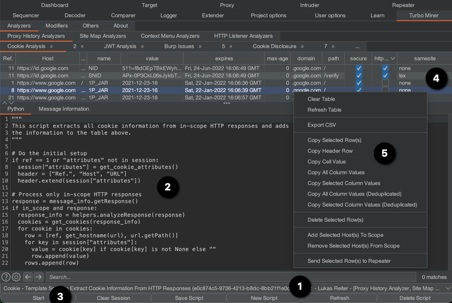

# Turbo Data Miner

This extension adds a new tab `Turbo Miner` to Burp Suite's UI as well as a new entry `Turbo Data Miner` 
to Burp Suite's `Extensions` context menu entry. In the new tab, you are able to write new or select 
existing Python scripts that are executed on each request/response item currently stored in the Proxy History, Side 
Map, or on each request/response item that is sent or received by Burp Suite.
  
The objective of these Python scripts is the flexible and dynamic extraction, correlation, and structured 
presentation of information from the Burp Suite state as well as the flexible and dynamic on-the-fly modification 
of outgoing or incoming HTTP requests. Thus, Turbo Data Miner shall aid in gaining a better and faster understanding of 
the data collected and processed by Burp Suite.

The following screenshot provides an example how Turbo Data Miner can be used to obtain a structured presentation of all 
cookies (and their attributes) that are stored in the current Burp Suite project. At the bottom, we select the 
corresponding Python script in the dropdown menu (see 1), which automatically loads the selected Python script into the 
IDE text area (see 2) and there, we can customize it, if needed. Alternatively, we can create our own script by 
clicking button `New Script`. The analysis is started by clicking button `Start` (see 3). Afterwards, Turbo Data Miner 
executes the compiled Python script on each Request/Response item. Thereby, the script extracts cookie 
information from each response (see source code in 2) and adds it to the table (see 4). Finally, in the table, we 
can sort per column to gain a better understanding of each cookie attribute or we can perform additional operations 
via the table's context menu (see 5).

As we can see, with Python skills, an understanding of the 
[Burp Suite Extender API](https://portswigger.net/Burp/extender/api/index.html) as well as an understanding of Turbo 
Miner's API (see Turbo Data Miner tab `About` or directly the 
[HTML page](https://github.com/chopicalqui/TurboDataMiner/blob/master/turbodataminer/about.html) used by the `About` tab), 
we can extract and structure any information available in the current Burp Suite project.

# Available Tabs

The `Turbo Miner` tab contains four additional tabs. Their purpose is described in this section.

## 1. Analyzers

The Python scripts in this tab usually structure the extracted information in a GUI table. From there, 
the results can be copied (as is or deduplicated) into the clipboard (e.g., to use them as payloads in the Intruder) 
or exported into a spreadsheet application for further (statistical) analyses.  
  
In this tab, you will find the following three analyzer plugins to extract and to display information in a 
structured way.

### Proxy History Analyzers

This analyzer executes the given Python script on each request/response item that is stored in Burp Suite's Proxy 
History. Use this analyzer to gather intelligence based on the data already stored in your Burp Suite project.

### Site Map Analyzers

This analyzer executes the given Python script on each request/response item that is stored in Burp Suite's Site 
Map. Use this analyzer to gather intelligence based on the data already stored in your Burp Suite project.

### Context Menu Analyzers

In contrast to the Proxy History or Site Map Analyzers, this analyzer only processes request/response items that were
sent via Burp Suite's context menu item `Extensions`.

In technical termis, this analyzer implements the interfaces `IContextMenuFactory` and `IContextMenuInvocation` of the 
[Burp Suite Extender API](https://portswigger.net/Burp/extender/api/index.html). As a result, any HTTP request/response 
items can be sent to this analyzers via Burp Suite's context menu item `Extensions`.

### HTTP Listener Analyzers

This analyzer implements the interface `IHttpListener` of the 
[Burp Suite Extender API](https://portswigger.net/Burp/extender/api/index.html). Thereby, it executes the current 
Python script after each response was received by Burp. Thus, if a request times out, then the Python script is not 
called for this request/response pair, and, as a result, this analyzer might not deliver complete results. Use this 
analyzer to gather intelligence from requests or responses that are currently sent or received (e.g., sent or 
received by Burp's Intruder for example).

## 2. Modifiers

Python scripts in this tab allow on the fly modifications on requests sent or responses received by Burp Suite. The 
following two modifiers are available.

### HTTP Listener Modifiers

This modifier implements the interface `IHttpListener` of the 
[Burp Suite Extender API](https://portswigger.net/Burp/extender/api/index.html). Thereby, it executes the current 
Python script after each response was received by Burp. Thus, if a request times out, then the Python script is not 
called for this request/response pair, and, as a result, this analyzer might not deliver complete results. Use this 
analyzer to gather intelligence from requests or responses that are currently sent or received (e.g., sent or 
received by Burp's Intruder for example).

### Proxy Listener Modifiers

This analyzer implements the interface `IProxyListener` of the 
[Burp Suite Extender API](https://portswigger.net/Burp/extender/api/index.html). Thereby, it executes the Python 
script after each request sent and response received.

## 3. Others

This tab contains plugins that do not belong to plugin types Analyzers and Modifiers.

### Custom Message Editors

This tab implements the interface `IMessageEditorTab` of the 
[Burp Suite Extender API](https://portswigger.net/Burp/extender/api/index.html). Use it to implement an encoder 
and decoder tab, which is automatically added to each message editor. Your Python script must implement the following 
three methods; for more information refer to the `IMessageEditorTab` specification.

    def is_enabled(content, is_request, session):
        """
        This method is invoked before an HTTP message is displayed in an custom editor tab, so that this custom 
        tab can indicate whether it should be enabled for that message.
        
        For more information, refer to the Burp Suite API, IMessageEditorTab interface, method isEnabled.
        :param content (List[bytes]): The message that is about to be displayed by this custom editor tab, or a 
        zero-length array if the existing message is to be cleared.
        :param is_request (bool): Indicates whether the message is a request or a response.
        :param session (dict): The dictionary allows storing information accross method calls.
        :return (bool) If the custom tab is able to handle the specified message, and so will be displayed within the 
        editor. Otherwise, the tab will be hidden while this message is displayed.
	    """
        result = True
        # todo: implement code
        return result
    
    def set_message(content, is_request, session):
        """
        This method compiles the message to be displayed in this custom editor tab.
        
        For more information, refer to the Burp Suite API, IMessageEditorTab interface, method set_message.
        :param content (List[bytes]): The original message based on which the new message, which is going to be 
        displayed by this custom editor tab, is created.
        :param is_request (bool): Indicates whether the message is a request or a response.
        :param session (dict): The dictionary allows storing information accross method calls.
        :return (List[bytes]) Returns the modified content of variable content.
        """
        result = content
        # todo: decode content
        return result
    
    def get_message(content, session):
        """
        This method converts back the currently displayed message.
        
        For more information, refer to the Burp Suite API, IMessageEditorTab interface, method set_message.
        :param content (List[bytes]): The original message based on which the new message, which is going to be 
        displayed by this custom editor tab, is created.
        :param session (dict): The dictionary allows storing information accross method calls.
        :return (List[bytes]) Returns the modified content of variable content.
        """
        result = None
        # todo: encode contents
        return result

**Note:** The last parameter `session` is of type dictionary and can be used to store information across methods. 
The parameter `header` is of type list and can be used to specify column header names in the JTable component, 
which is part of the `IMessageEditorTab`. The parameter `rows` is a two-dimensional list, which can be used to add 
rows to the JTable component. For more information refer to the table in the next section.

## 4. About

This tab contains the documentation about Turbo Data Miner's Application Programming Interface (API).

# Author

**Lukas Reiter** ([@chopicalquy](https://twitter.com/chopicalquy)) - 
[Turbo Data Miner](https://github.com/chopicalqui/TurboDataMiner)

# License

This project is licensed under the GPLv3 License - see the 
[license](https://github.com/chopicalqui/TurboDataMiner/blob/master/LICENSE) file for details.